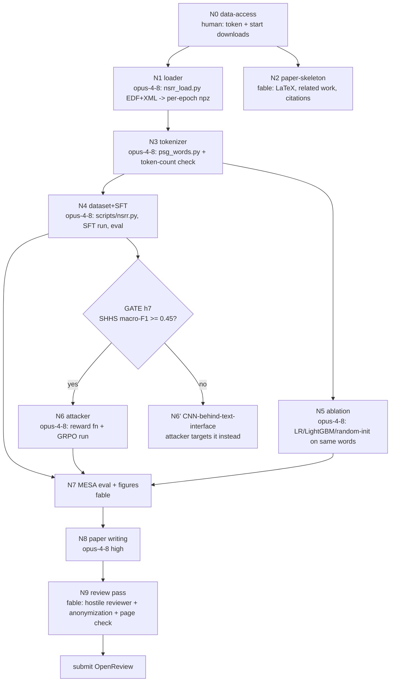

# PLAN: Loki -> "Sleep as a Language" (BrainBodyFM @ NeurIPS 2026)

Written 2026-09-04 12:05 PDT. Inputs: repo inventory, 5-frame ADHD divergence, 3-branch deepen, 3-seat council (reviewer / engineer / clinician), Musk 5-step. Raw artifacts in `plan/`.

## 0. The clock (READ FIRST)

You said deadline = **Sept 5, 04:00 PST**. That is **16 h from now**, not the ~32 h the brief assumed.
CFP says "September 5, 2026 AoE". AoE = UTC-12, so end of Sept 5 AoE = **Sept 6, 04:59 PDT** = ~41 h.
Confirm which one is real before we lock the schedule. This plan has two tiers:

- **T16** (your stated deadline): MVP paper. One contribution, one table, one figure.
- **T40** (AoE, if correct): full paper with red-team + ablations.

Everything below is written for T16 with T40 extensions marked `[T40]`.

## 1. First principles (Musk 5-step, applied)

**Question the requirements.**
- "Maximize transfer of the text stack" has an owner (you) and a reason (no time to build new infra). Keep.
- "GRPO must be used" has no stated reason. The reviewer seat says GRPO with 1-token actions + 0/1 reward is REINFORCE-flavored cross-entropy and reads as "SFT with extra steps". Verdict: GRPO stays **only** where it is genuinely RL, the red-teamer. The stager gets SFT.
- "Tokenizer for EEG/SpO2" has a reason (LLM must ingest it) but the clinician seat says raw SpO2 digits are useless for staging (SpO2 lags stage by 20-30 s). Keep the tokenizer, change what it emits.

**Delete.** Learned BPE "sleep grammar" (0% chance it changes the story in 16 h). YASA K-complex flag (frontal, absent on SHHS C4: a cohort confound, not a finding). 32-char raw SAX of EEG envelope (redundant with bandpowers). 30-digit SpO2 string. GRPO for the stager. Ollama / LLM-judge reward. vLLM.

**Simplify.** One EEG channel (C4-A1 on SHHS = C4-M1 on MESA, same electrode). Per-night quantile binning for every symbol (this is the whole cross-cohort bet). Single-letter stage tokens (`W A B C R`, since `N1` is 2 tokens in Qwen). Reward functions are pure Python over strings.

**Accelerate.** Download and parse are the critical path (engineer: "most likely failure is download+parse eating 2x budget"). Start the download in the first 10 minutes. Parse 3 nights locally on the M4 while the bulk downloads on the GPU box.

**Automate last.** No pipelines, no configs. Scripts with hardcoded paths are fine.

**Idiot index.** Theoretical floor: ~250 lines of new Python (1 loader, 1 tokenizer, 1 dataset builder, 1 reward fn) + 1 SFT run + 1 GRPO run. Everything else in the repo transfers. If an agent proposes >1000 new lines, it is building fat.

## 2. Transfer map (every Loki piece, where it goes)

| Loki component | Fate | New role |
|---|---|---|
| `Qwen2.5-0.5B-Instruct` policy + tokenizer | **Kept unchanged** | Consumes symbolic epoch words; no vocab changes |
| `DialoGPT` | Deleted (already superseded by Qwen in repo) | |
| `scripts/hotpotqa.py` dataset builder pattern | **Copied** -> `scripts/nsrr.py` | `{prompt, answer, evidence}` becomes `{epoch_word, stage, context}` |
| `scripts/prompts/*_system.j2 / *_user.j2` | **Copied** -> `nsrr_stager_*.j2`, `nsrr_attacker_*.j2` | "Question + evidence" -> "previous 10 stages + epoch word + demographics" |
| `<reasoning>/<misdirection>` output tags | **Kept** for attacker | `<misdirection>` now wraps the edited epoch word or injected metadata line |
| `harmbench_simple_reward_function.py` (format + length + keyword heuristics) | **Kept, terms swapped** | format gate -> plausibility vetoes; length term -> edit budget; keyword hits -> label-flip |
| "did the frozen target get fooled" reward | **Kept verbatim** | target = frozen SFT stager, forward pass on edited word |
| `harmbench_trainer.py` (TRL GRPOTrainer config) | **Kept** | attacker training, `max_completion_length=128`, `num_generations=8` |
| `harmbench_sft_trainer.py` | **Kept** | stager SFT warm start |
| `harmbench_custom_grpo.py` CPU loop | Deleted | |
| Ollama / `ensure_ollama_running` | Deleted | |
| `Dockerfile.runpod`, `deploy_runpod.sh`, `runpod_config.yaml` | **Kept** | add `nsrr` gem + pyedflib to image |
| wandb logging | **Kept** | |
| FEVER / HotpotQA / HarmBench data | Deleted | |
| `pyproject.toml` | **Kept** + `pyedflib`, `scipy`, `yasa` | |

Net: ~90% of infra transfers. What does not transfer is exactly the data (text -> PSG), which is unavoidable.

## 3. Converged design (post-council)

**Title (working):** *Symbolic PSG words let an unchanged text LLM stage sleep, and a text-native red-teamer shows what it learned.*

**C1. Symbolic PSG tokenizer (`tokenizer/psg_words.py`).** Each 30 s epoch -> one ASCII word, ~40 chars, ~25 Qwen tokens. All quantization is **per-night quantile** (4 levels: `a b c d`).
- EEG C4: relative bandpower delta/theta/alpha/sigma/beta per 5 s window -> 6x5 letters. Plus slow-wave fraction (0 / <20 / 20-50 / >50%) -> 1 symbol. Plus YASA spindle count bucket -> 1 symbol.
- EOG: REM count bucket + SEM flag + L/R phase sign -> 3 symbols. (Clinician: 16-segment SAX cannot see REMs.)
- Chin EMG: night-relative RMS bucket per 5 s, bandpassed 10-50 Hz -> 6 letters.
- SpO2: min, mean, desat flag -> 3 symbols.
- Time: hours since lights-off bucket -> 1 symbol. (Clinician: single most useful cheap feature.)
Prompt = demographics line + previous 10 stage letters + current word. Target = 1 letter.

**C2. Stager = SFT Qwen-0.5B on 200 SHHS nights.** Evaluate on 20 SHHS held-out and 60 MESA zero-shot. Per-class F1 and confusion matrix, not just macro-F1.

**C3. Mandatory ablation (reviewer's "reject sentence" killer).** Same words -> logistic regression and LightGBM. Qwen with randomly re-initialized weights. If LLM does not beat LR on identical inputs, we say so in the abstract and the paper becomes "a symbolic tokenizer that is attackable and interpretable". Still a fine workshop paper.

**C4. Red-teamer `[T40, or T16 if C2 done by h7]`.** Loki misdirection policy verbatim. Two action spaces: (a) edit the epoch word under a ≤10%-symbol, ±1-level, continuity-preserving budget with clinician hard vetoes (spindle in W/R without sigma, atonia outside R, SpO2 slope limits); (b) inject a metadata line (age/BMI/AHI/"tech note") with zero signal edits. Reward = flip − λ·edits, hard-zero on veto. **Second-scorer test:** LR on the same words must still call the original stage, otherwise the edit made a genuinely ambiguous epoch, not an attack. Report only on confident W/N2/N3/R epochs. Baselines: random edits, greedy single-symbol search. Deliverable: histogram of which symbols get edited per (from -> to) transition, compared to AASM criteria (EMG for R->W, sigma for N2->N1, SW-fraction for N3->N2).

Headline results if it works: (1) metadata text flips the stager more than signal edits (shortcut learning); (2) edit loci mirror AASM rules (interpretability); (3) cross-cohort drop decomposed into normalization vs rule shift vs residual.

## 4. Data access (do this NOW, in this order)

1. Go to https://sleepdata.org/token, copy token. Do not paste it in chat; put it in `~/.nsrr_token` on the GPU box (and locally).
2. Gem is already installed locally (`nsrr` 8.0.0). On the GPU box: `gem install nsrr --no-document`.
3. Annotations first (KB each, minutes total):
   ```
   nsrr download shhs/polysomnography/annotations-events-nsrr/shhs1 --fast
   nsrr download mesa/polysomnography/annotations-events-nsrr --fast
   nsrr download shhs/datasets --shallow --fast     # shhs1-dataset-*.csv, harmonized covariates
   nsrr download mesa/datasets --shallow --fast
   ```
4. EDFs, subset via regex (SHHS1 ~50-80 MB/night, MESA ~250-400 MB/night):
   ```
   nsrr download shhs/polysomnography/edfs/shhs1 --file="^shhs1-20[0-1][0-9]{3}\.edf$" --fast   # ~220 nights
   nsrr download mesa/polysomnography/edfs --file="^mesa-sleep-00[0-6][0-9]{2}\.edf$" --fast    # ~70 nights, trim to 60 good
   ```
   Also 3 SHHS + 2 MESA nights to the M4 for local dev (~1.5 GB).
5. Known gotchas (clinician seat): SHHS `EEG` = C4-A1 125 Hz, `EEG(sec)` label varies (`EEG 2`, `EEG(SEC)`); MESA `EEG3` = C4-M1 256 Hz, `EOG-L/R`, `EMG`, `SpO2`. NSRR XML `EventConcept` strings: `Wake|0`, `Stage 1 sleep|1`, `Stage 2 sleep|2`, `Stage 3 sleep|3`, `Stage 4 sleep|4`, `REM sleep|5`, `Unscored|9`. Map 3+4 -> N3. XML epoch count often < EDF length: truncate to min. SaO2 < 50 = artifact, mask. Exclude nights with TST < 3 h. Do not feed arousal events to the stager (leak).
6. GPU box: 1x A100 80GB or H100, 150 GB volume. Reuse `Dockerfile.runpod`.

## 5. Agent DAG (opus-4-8 builders, fable-5-1 reviewers, max 2 concurrent builders)

Nodes are worktrees. No two builders share files. Every node ends with a runnable check and a `swarm report` with artifact.



Node specs (pre-digested, paste into spawn prompts):

- **N1 loader** (`nsrr_load.py`, ~120 lines). `load_night(edf, xml, cohort) -> dict(eeg, eog_l, eog_r, emg, spo2, stages, fs)`. Channel map dict per cohort. Resample EEG/EMG to 100 Hz, EOG to 50 Hz. Stage map above. Truncate to min(len). Return None + log reason on failure. Check: runs on 3 SHHS + 2 MESA local nights, prints epoch counts and stage histogram, asserts `len(stages)*30*fs == len(eeg)`.
- **N3 tokenizer** (`psg_words.py`, ~150 lines). `night_to_words(night) -> list[str]`. Spec in §3 C1. Per-night quantile bins. Check: tokens/epoch under Qwen tokenizer ≤ 40, prints 5 sample words per stage, and a 2-line LR on the words gets > 0.5 macro-F1 on one held-out night (sanity that the words carry signal).
- **N4 dataset + SFT** (`scripts/nsrr.py` + `training/nsrr_sft_trainer.py`, copied from `harmbench_sft_trainer.py`). Prompt template `nsrr_stager_user.j2`. Single-letter targets. Qwen-0.5B bf16, seq 256, batch 64, lr 1e-5, 1 epoch over ~200k epochs ≈ 20 min on A100. Eval script prints per-class F1 + confusion on SHHS held-out and MESA. Check: eval JSON written to `results/`.
- **N5 ablation** (`ablation.py`). Same word strings -> char n-gram + LR, LightGBM on the raw quantized features, Qwen random-init SFT. Same eval JSON format.
- **N6 attacker** (`training/nsrr_attacker_reward.py` copied from `harmbench_simple_reward_function.py`, `training/nsrr_attacker_trainer.py` from `harmbench_trainer.py`). Reward spec §3 C4. GRPO: batch 32 = 4 prompts × 8 gens, ≤128-token completions, 500 steps ≈ 30 min. Engineer warns: format gate reward −1, hard edit-budget check, λ tuned so unedited = 0. Check: attack-success vs edit-budget curve, random + greedy baselines, edit-locus histogram.
- **N2/N8/N9 paper**. 5 pages, modified NeurIPS 2026 style from CFP zip. Must-cite (reviewer seat): SleepFM 2405.17766, NeuroLM 2409.00101, LaBraM (ICLR 2024), BENDR 2101.12037, BIOT 2305.10351, U-Sleep (Perslev 2021) for SHHS->MESA numbers, OpenTSLM 2510.02410, Chronos 2403.07815, LLMTime 2310.07820, Time-LLM 2310.01728, **Tan et al. 2406.16964** ("are LMs useful for TS"), SAX (Lin 2007), YASA (Vallat 2021), Liu 2305.15525. Verify ids before citing.

Spawn discipline: 2 builders live at once. Order: N1 -> (N3) -> (N4 ‖ N5) -> (N6 ‖ N7) -> N8 -> N9. N2 runs on fable in parallel from h0 (cheap, no file overlap).

## 6. Timeline (T16, h0 = 12:00 PDT Sept 4, deadline 04:00 PDT Sept 5)

| h | Wall | Do | Kill switch |
|---|---|---|---|
| 0-0.5 | 12:00 | Token, GPU box up, annotations download, EDF subset download started, 5 local dev nights | |
| 0.5-2.5 | 12:30 | N1 loader on local nights. N2 paper skeleton in parallel. | h2.5: loader fails on MESA -> SHHS-only paper, MESA becomes `[T40]` |
| 2.5-4.5 | 14:30 | N3 tokenizer. YASA spindles optional, 30 min cap. | h4: LR-on-words < 0.5 on one night -> tokenizer bug, not design; fix before moving |
| 4.5-5 | 16:30 | Ship loader+tokenizer to GPU box, tokenize all nights (16 procs, ~20 min) | |
| 5-7 | 17:00 | N4 SFT + eval ‖ N5 ablation | **h7 GATE**: SHHS macro-F1 ≥ 0.45 and beats LR -> N6. Else N6' (attack LR/CNN behind text interface). |
| 7-9.5 | 19:00 | N6 attacker ‖ N7 MESA eval + figures | h9.5: attack success < 20% -> report curve, stop |
| 9.5-14 | 21:30 | N8 paper writing (opus high), figures from `results/` | |
| 14-15 | 02:00 | N9 hostile review, anonymize, page limit, PDF check | |
| 15-15.5 | 03:00 | Submit. Target 03:00, hard stop 03:45. | |

**Sleep:** none in T16. If deadline is actually T40, insert 5 h sleep at h16 and move N6/N8 into the second day with the full ablation set.

Drop order under pressure: YASA symbols -> adversarial retraining -> attacker MESA transfer -> attacker entirely (paper becomes tokenizer + ablation + cross-cohort) -> MESA (paper becomes SHHS-only tokenizer study, weakest but submittable).

## 7. Odds (council-calibrated)

- P(submit something coherent by T16): **0.55**. By T40: **0.75**.
- P(accept | submitted, T16 MVP without attacker): **0.30**. Workshop is non-archival and broad, but the reviewer seat scored the LLM-decorative version 4/10.
- P(accept | submitted with attacker + ablation + interpretability histogram): **0.50**.
- Most likely way this fails: download + EDF parsing eats 2x its budget (engineer and reviewer both flagged it independently). Mitigation is the ordering above: download starts at minute 0, and the annotation-only fallback (`plan/deepen_hypnogram.json`) needs zero EDFs.
- Most likely way I'm wrong on the design: Tan et al. effect. The LLM adds nothing over LR on symbolic words. That is why N5 runs in parallel with N4, not after, so we know by h7 and reframe honestly.

## 8. What I need from you right now

1. Confirm deadline: your Sept 5 04:00 PST, or the CFP's AoE (Sept 6 ~05:00 PDT)?
2. NSRR token into `~/.nsrr_token` (locally and on the GPU box). Do not paste it here.
3. GPU box: RunPod? Give me SSH host or say "spin one up" and I use `deploy_runpod.sh`.
4. Go/no-go on the design. On "go" I spawn N1 + N2 immediately.
